# 红芯浏览器，骗经费也请认真点好吗  
前几天看到一报道说红芯搞了个国产内核出来，一开始挺兴奋的，毕竟国内大部分浏览器其实也都是套个壳的chrome，于是就决定下载下来试试，没想到还是too young，被实实在在坑了一把。  
首先贴一下[官网地址]，点进去我们可以看到下面这张图  
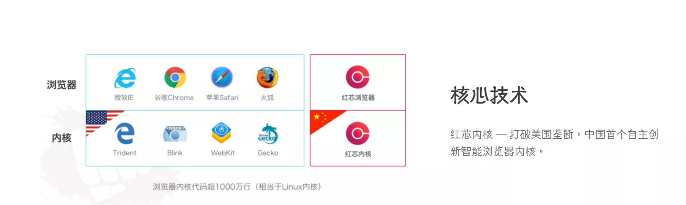  
刚看到的时候，哇，第五个内核，牛逼啊。这么牛逼当然应该下载下来试试。  
找了半天下载按钮，硬是没找到，后来才发现要去红芯隐盾页面下载。这里提供一下[下载地址][]，欢迎作死  (防止官方撤包，这里做了个[备份][])  
直接下载安装，点击后没申请管理员权限就自己安装了，连个确认都没有，果然，appdata目录，流氓同款安装路径（安装程序没适配高分屏这个就不吐槽了）
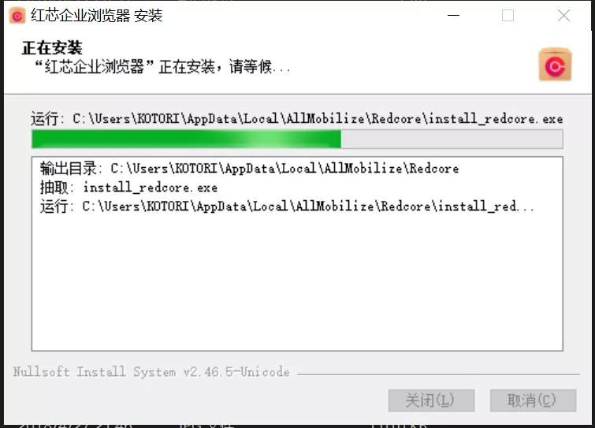  
打开后，总算浏览器本体是适配了高分屏的，但是卡的一批  
  
琴梨梨的配置是5820K+24G+980Ti，虽然老机器了，可是这配置运行Chrome以及国内各种捆绑来的浏览器都没这么卡过，于是琴梨梨决定找出为什么这么卡。  
用Chrome打开淘宝，我们可以发现Chrome占用了不少GPU资源  
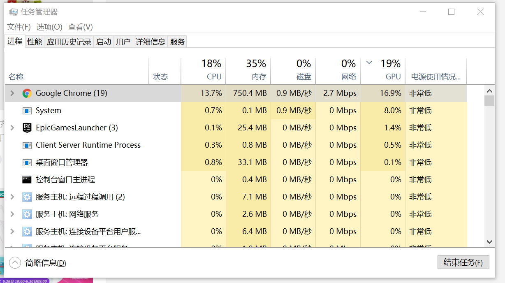  
接下来我们看看红芯浏览器，我屮，GPU占用0%？？？？？0%？？？？？0%？？？？？你TM告诉我你竟然全用CPU渲染没有硬件加速？？？？？  
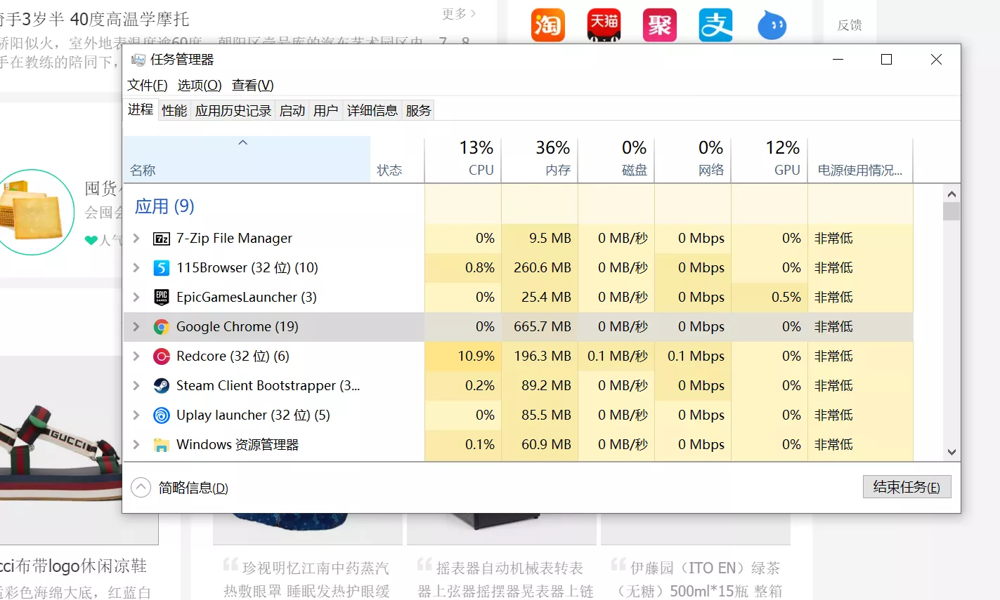  
卡顿的原因算是找到了，这浏览器硬件加速都没有，在4K屏上不卡才怪  
对比一下115浏览器，国产毒瘤代表之一，GPU加速效率不高，但是有加速，基本不卡能用  
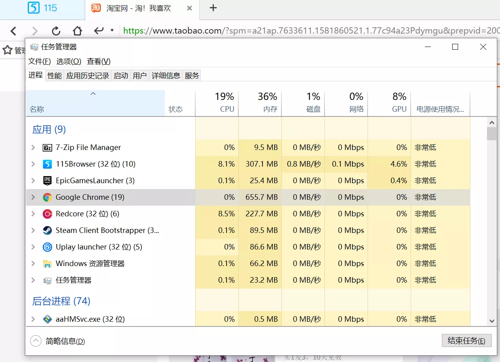  
连IE都支持硬件加速，这浏览器竟然不支持，那就更有必要看看这个“自研内核”到底是个什么玩意了。  
直接看UA  
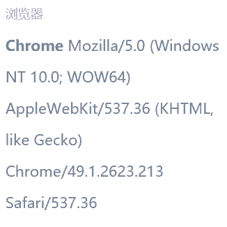  
Chrome49？？？？？这个自研内核难道真的是Chrome换皮？咱接着看  
地址栏输入qinlili.cn这个不存在的域名，欸，怎么这个图标惊人的一致啊（左侧Chrome68）  
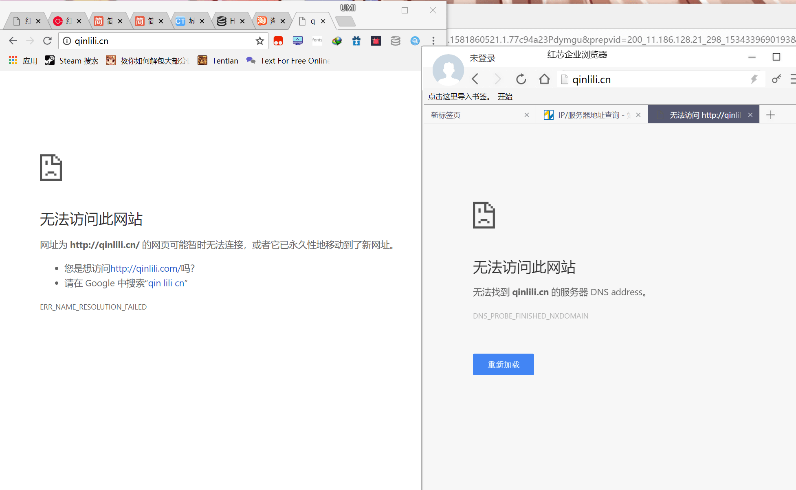  
熟练的按下F12打开调试窗，欸这TM不就是Chrome同款吗  
  
测试到这里，琴梨梨基本已经确定这东西就是Chrome换皮了，不过还是证据不够充分，接下来琴梨梨要拿出Chrome独有的其他内核模仿不来的...小恐龙！！！  
在Chrome断网的时候，有这么一只可爱的小恐龙  
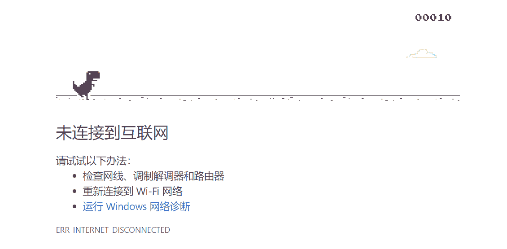  
那我们来看看这个自主内核断网的时候会怎么样  
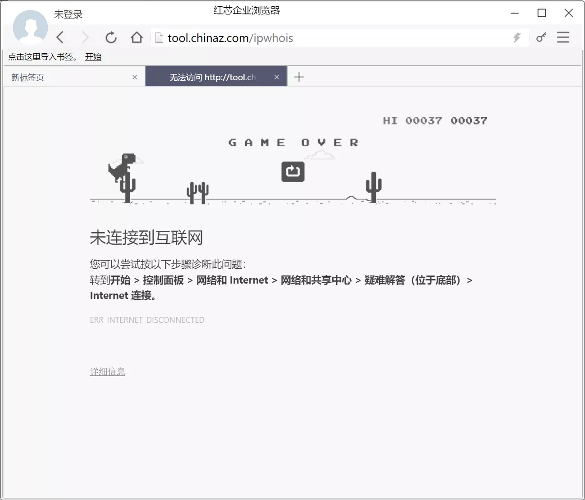  
卧槽？？？？？还真的有小恐龙！！！！！  
此处链接科普[小恐龙故事][]  
好了现在已经确定这红芯浏览器就是  Chrome49·改 了，接下来我们看看对于可能暴露chrome内核的地方，这个团队做了什么  
设置页面地址把前面的chrome换成了redcore  
  
那我们试试原版的chrome://settings  
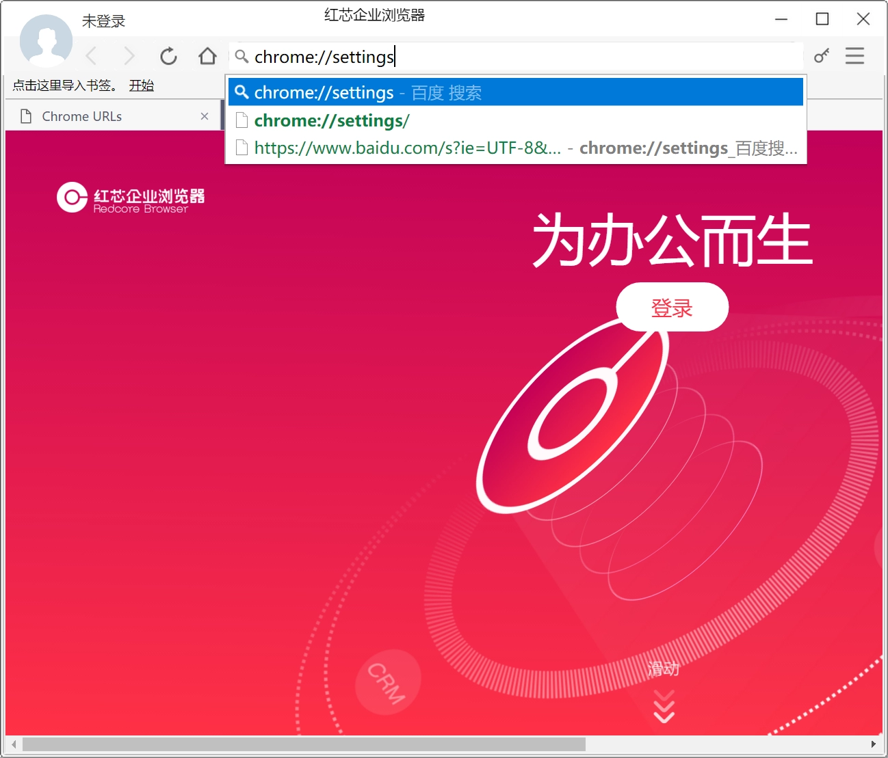  
按下回车就进入百度，这个隐藏可以，牛逼  
然而...  
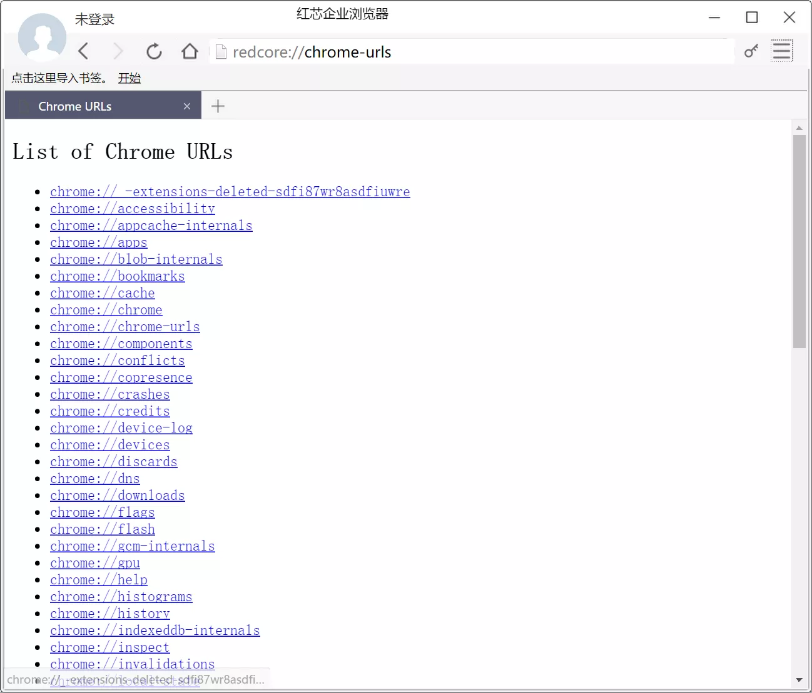  
可以说是纸包不住火了，不过点击这个页面上所有链接都不能正常跳转，估计魔改没改彻底  
嗯？下面竟然一部分链接改了？！！  
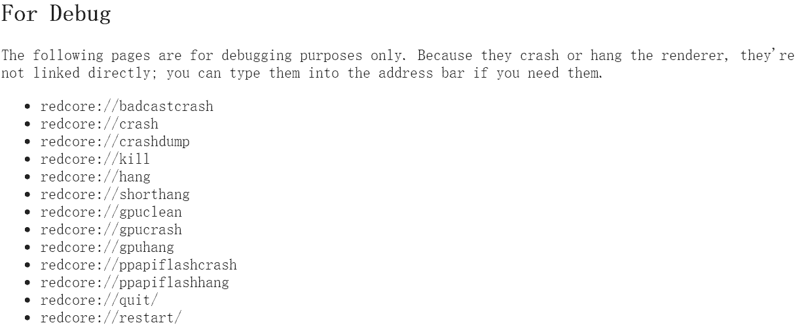  
看看这浏览器的目录吧  
劲爆，文件名都不改，服了  
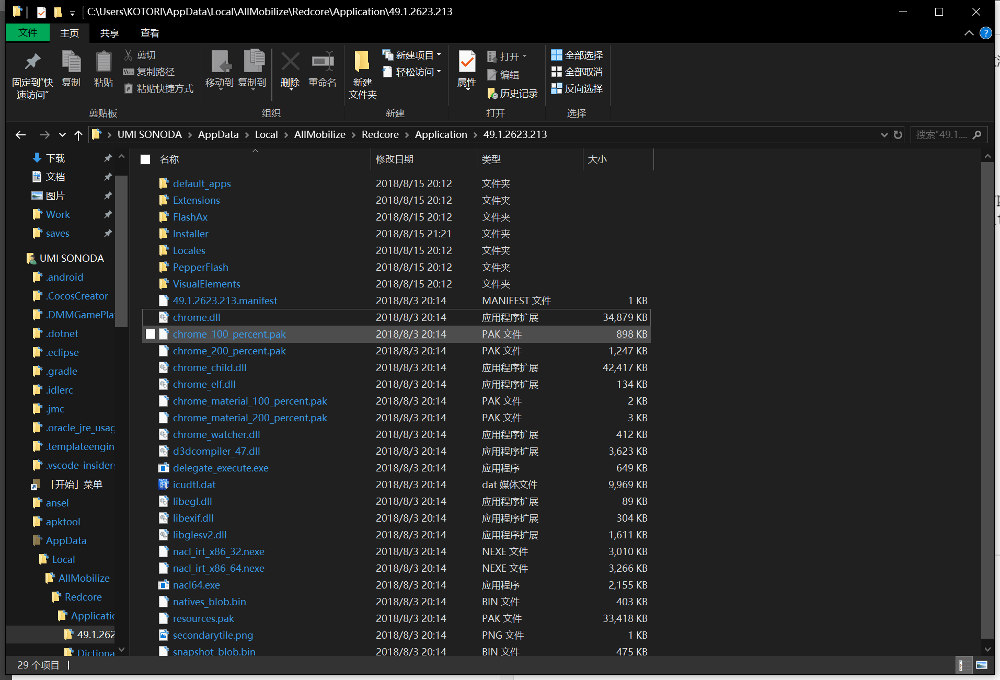  
好，揭露这红芯浏览器的本质就到这里了，接下来咱们看看这东西骗了多少人。  
  
原来只要copy一下Chrome就能拿到兼容性认证啊，琴梨梨要通宵编译一个琴梨梨浏览器也去搞个兼容性认证！  
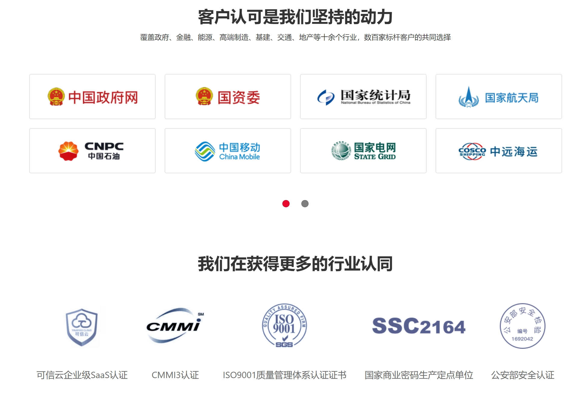  
卧槽还有这么多国字号？？？？？  
咱也不是不想支持国产，作为土生土长的国人，当然是希望国产越做越好，可是这种拿着开源项目骗经费还做的一塌糊涂甚至硬件加速都没有的，我看，您还是认真点吧，别哪天不小心被国际上扒了那就真的丢脸丢出国门了。  
附：[我并不是第一个发现的][]

[官网地址]: https://qinlili.bid/redirect.html?target=https://browser.redcore.cn/
[下载地址]: https://qinlili.bid/redirect.html?target=http://d.redcore.cn/install_redcore.3.0.54.exe
[备份]: https://qinlili.bid/redirect.html?target=https://qinlili.ctfile.com/fs/8067059-303883441
[小恐龙故事]: https://qinlili.bid/redirect.html?target=https://www.g-cores.com/articles/94332
[我并不是第一个发现的]: https://qinlili.bid/redirect.html?target=https://dig.chouti.com/pic/show?nid=4bea54714fcbeed6b9ef475a92aa3217&lid=21492691