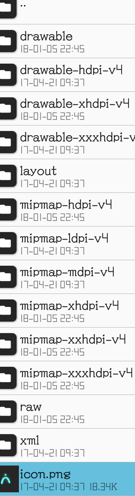
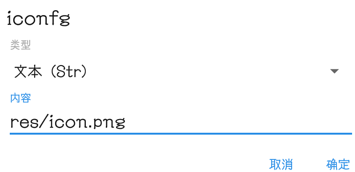
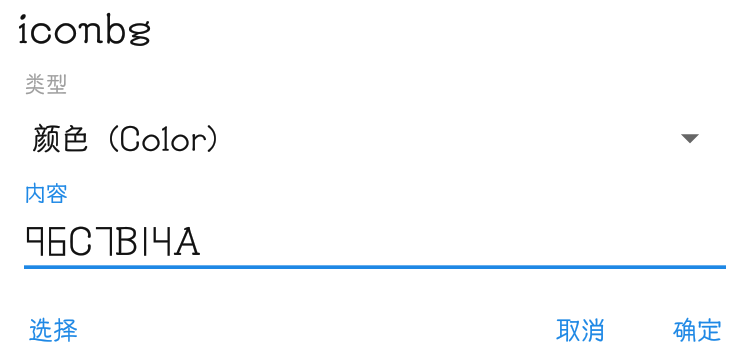
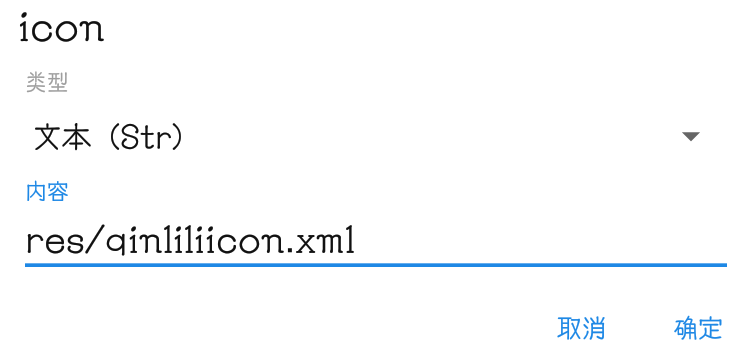
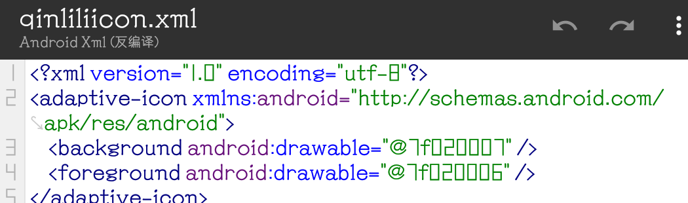
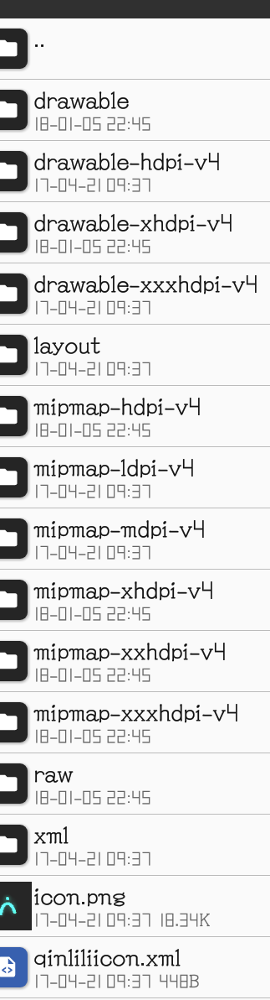

# [⇦][] 适配8.0+的自适应图标  
自适应图标是安卓8.0引入的新特性，可以让图标随系统主题变化，保持高度整齐，这个特性其实适配并不难  
准备工作：抠取图标前景（这个不用我讲了把），提取背景色  
步骤1：添加图标前景  
把图标前景文件丢进安装包，丢哪里都行，记住路径就行  
  
打开arsc，在drawable/drawable下新建资源，类型为文本，把图标前景路径输进去，并记下这个资源的arsc ID比如7F020006  
  
步骤2：添加图标背景  
打开的arsc别急着关，接着新建资源，类型为颜色，把你要的背景色输进去，一样记下arsc ID比如7F020007  
  
步骤3：处理mipmap分类  
arsc还是别急着关，找到原来的图标，记下arsc ID（一般在mipmap里），比如7F030000  
在mipmap里（其实drawable里也可以，但是规范点还是mipmap里）新建分类-anydpi-v26  
  
进入这个分类，新建资源，选择来源，把原来的图标选中，确定，然后把路径修改为自适应图标xml你想要的路径  
  
步骤4：处理xml文件  
新建一个xml文件，按照下面的格式填写  
<?xml version="1.0" encoding="utf-8"?>  
<adaptive-icon xmlns:android="http://schemas.android.com/apk/res/android">  
    <background android:drawable="@背景arsc ID" />  
    <foreground android:drawable="@前景arsc ID" />  
</adaptive-icon>  

比如我们把刚刚保存的arscID输进去，就是图中这样，保存，回编译  
  
在步骤3里我们已经提前输好了xml的路径，接下来我们把这个xml按照输好的路径丢进安装包  
  
截至到现在，我们已经完成了自适应图标的适配，签名安装后系统会根据系统主题自动裁切图标  
  

[⇦]: ../../list.md
