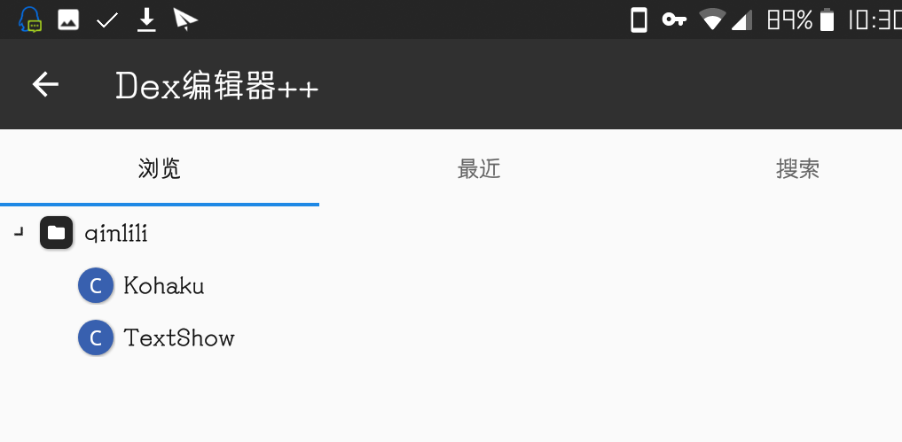
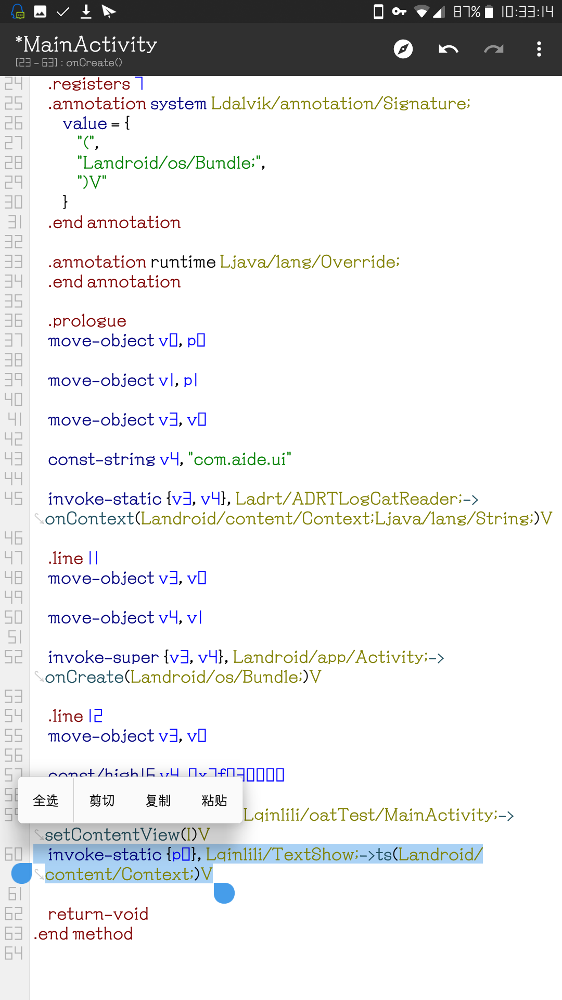
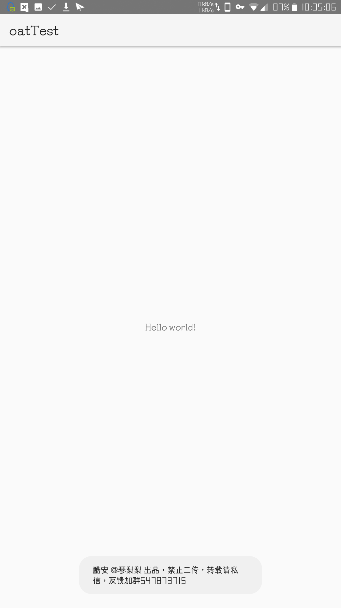
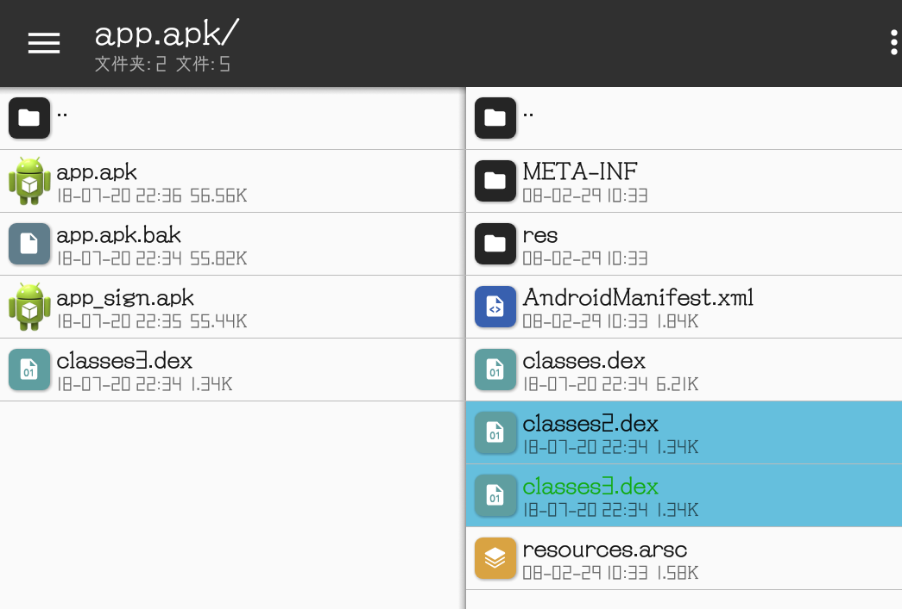
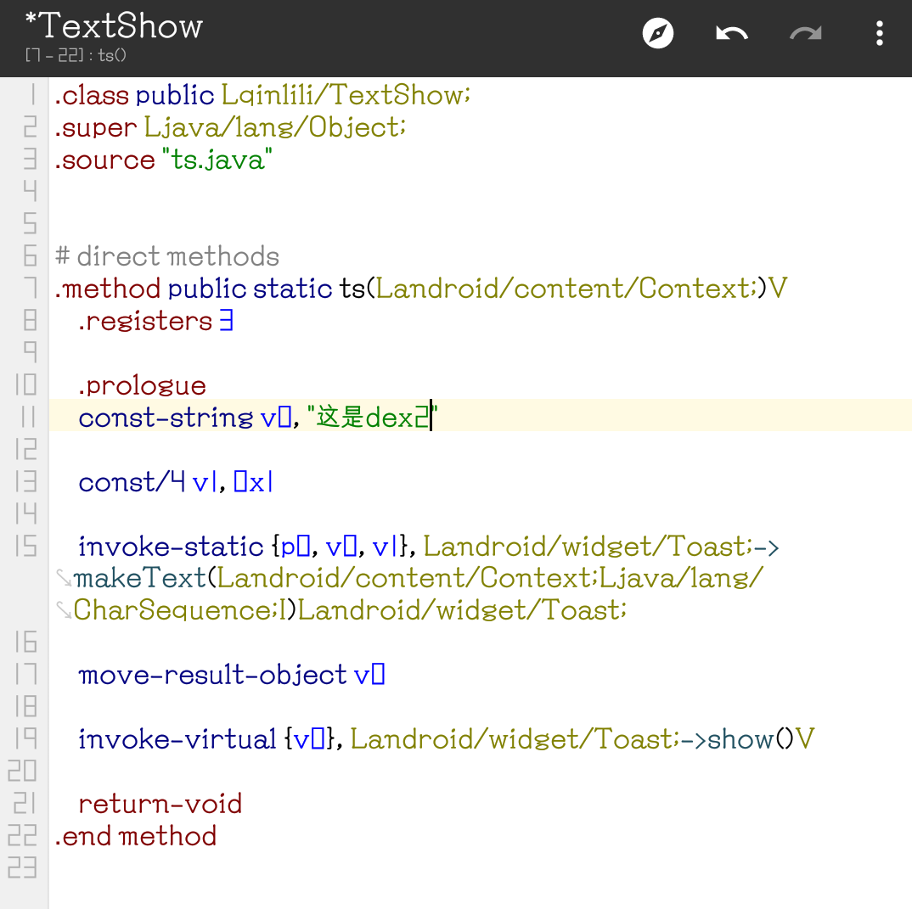
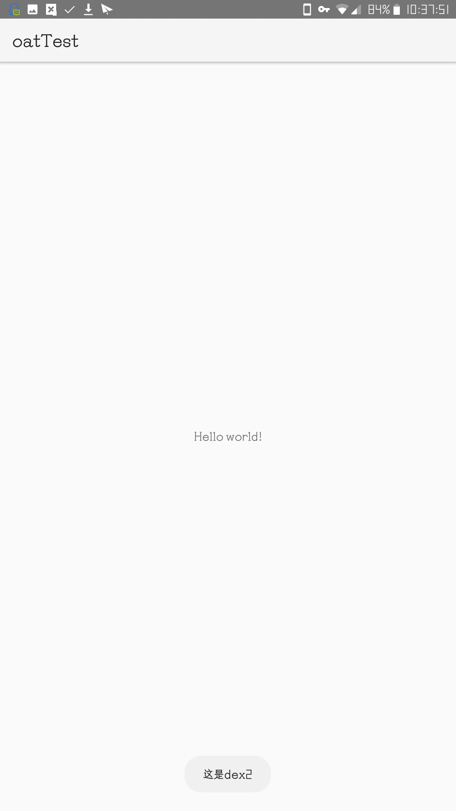

# [⇦][] 对dex2oat机制的一点发现  
众所周知4.4.4开始引入的art会在dex执行前调用dex2oat预编译，把多个dex合并为一个oat文件。  
在dalvik时代，重复类是不可能存在的，因为编译到一个dex的java文件本身就不能重复，一个dex里也不可能有重复类。但是不同dex里是可以有重复类的，例如随便找俩app提取classes.dex，很可能都包括appcompat包。那么如果将这样的两个dex执行oat，很明显，为了避免冲突，只能有一个重复类活下来，但是查阅了很多资料，都没查到oat的顺序，所以就自己测试了一下。 
首先用aide写一个helloworld  
  
接下来要对测试app动手脚了  
现在有这样一个dex，包括弹出toast的method，其中toast的内容已经写入dex。  
  
把测试dex命名classes2.dex丢进apk，并且在MainActivity调用toast的method  
  
添加invoke语句  
签名安装，可以看到弹出了toast  
  
弹出toast  
复制一份包含toast代码的dex，命名classes3.dex也丢进apk  
  
处理完成的apk  
把dex2里toast的文字改为“这是dex2”，同理dex3里的就是“这是dex3”  
  
修改字符串  
签名安装打开，发现弹出的toast是“这是dex2”  
  
新的toast  
经过这样一个简单的测试，我们可以得出结论：dex2oat面对重复类时，会选取靠前面的那个。  
可能有人会问，这个测试有什么意义。实际上，在明白dex2oat面对重复类的处理后，对制作有加固app的修改版有极大帮助。加固后的app运行前也必须oat，如果遇到脱壳后不能塞回去运行的情况，我们只需要把包含破解代码的类单独打进一个dex放在加固dex前面，就可以利用oat机制在不修改加固dex的情况下完成破解。  
这个特性同时也可以对热更新开发者提供一些思路。很明显，热更新不可能直接把java源码下发，只能下发dex文件，在本地把基线dex给反编译然后合并再回编译很明显不可能，毕竟baksmali.jar和smali.jar加起来都快5m了，热更新框架不可能搞这么大。但是利用dex2oat的这个特性，我们可以只下发包括更新代码的dex，客户端接收后把新dex作为classes.dex，旧dex作为classes2.dex，送进dex2oat，就能得到一个更新过代码的oat文件，尽可能简单的完成热更新。  
测试用的apk丢这里了[oatTest.apk][]   
其实利用好dex2oat的特性，可以达成很多非常规操作，又比如琴梨梨之前写的[这篇文章][]  

[这篇文章]: alistub.md
[oatTest.apk]: https://qinlili.ctfile.com/fs/8067059-299547329
[⇦]: ../../list.md
