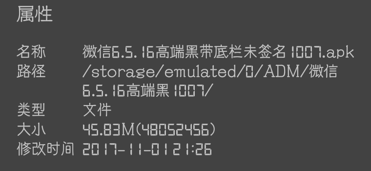
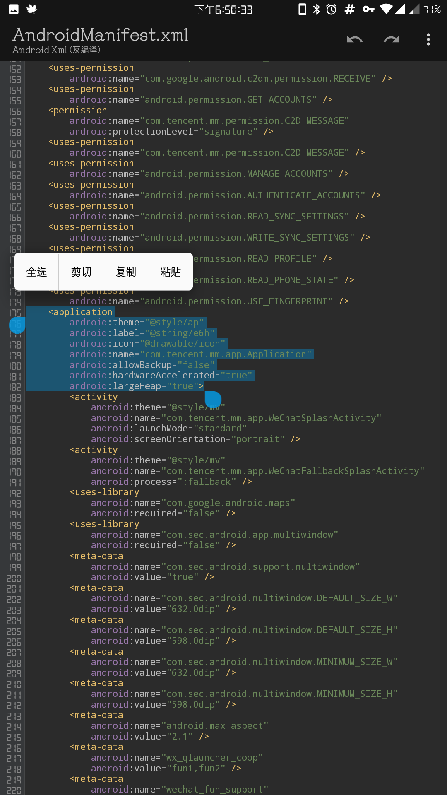
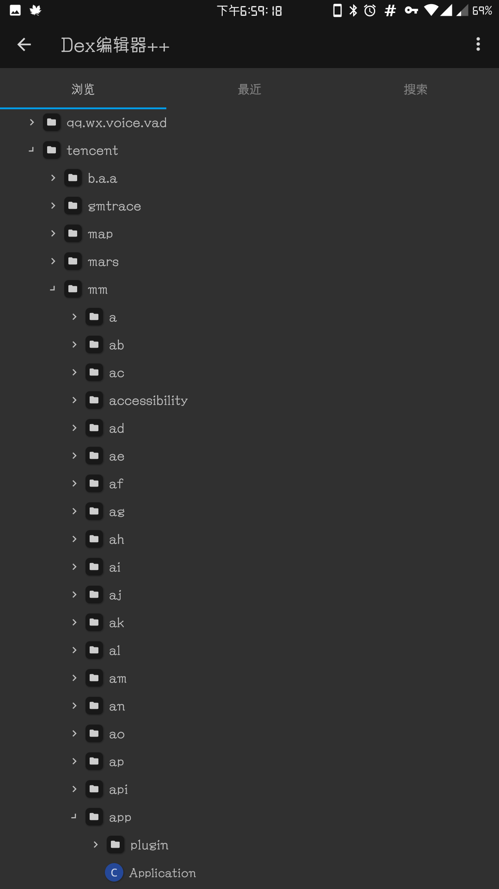
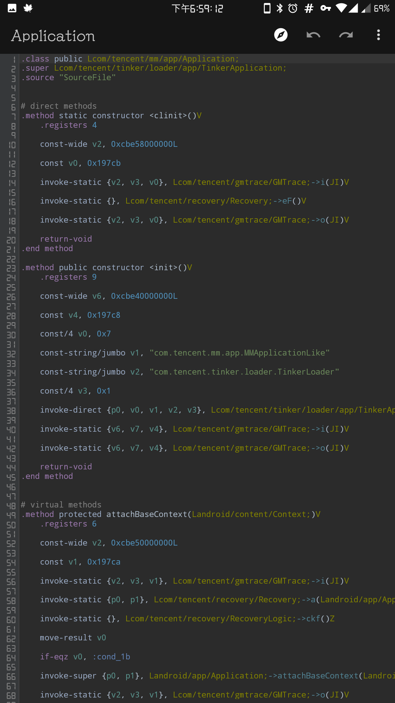
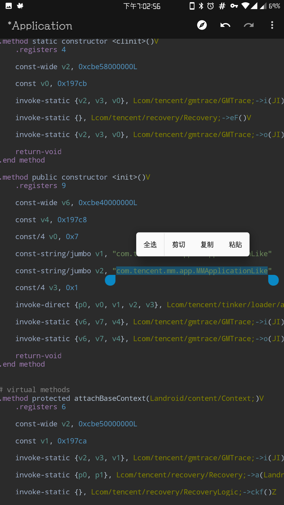
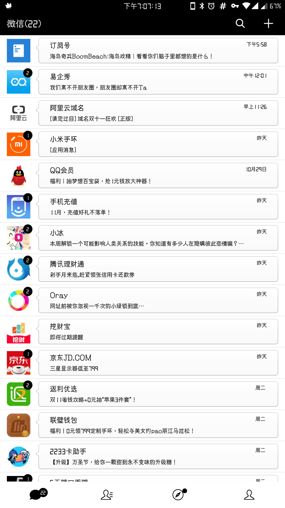
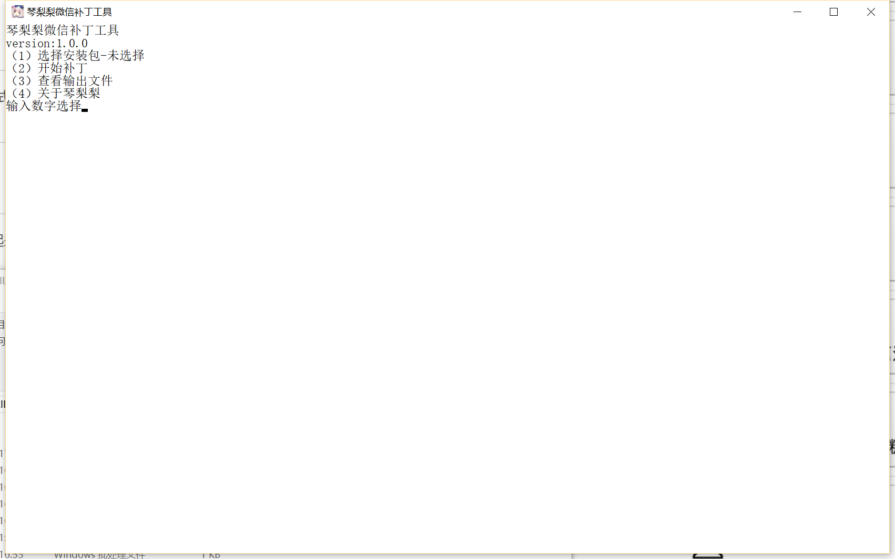

# [⇦][] 干掉微信Tinker热更，微信本该如此极速  
之前在[是谁让安卓变卡了][]一文里提到了Tinker热更新对性能的影响，最近特地分析了Tinker的原理，总算找到了解决办法  
工具:还是MT管理器(还是一样可以用apkdb，但是这次反编译记得勾上反编译classes)  
准备工作:拿出微信安装包就行了，琴梨梨继续用昨天加入网页浏览功能的安装包  
  
做好准备工作，接下来就让我们开始吧！  
#### STEP1 分析微信的manifest(虽然下面提供了代码位置，但是建议你看看怎么寻找具体代码位置，买鱼不如学渔)  
划过一长串权限(微信可真是权限狂魔啊)，找到application  
  
这串声明指定了应用程序本体信息，我们来具体分析一下  
>     <application应用程序声明头  
>         android:theme="@style/ap"主题标签为ap(很明显资源混淆了)  
>         android:label="@string/e6h"应用程序名标签为e6h，很明显也混淆了  
>         android:icon="@drawable/icon"指定应用程序图标  
>         android:name="com.tencent.mm.app.Application"启动的代码位置，这是我们这次修改的关键  
>         android:allowBackup="false"禁止备份，微信用这种办法避开大部分系统备份接口，以推广自家xx宝的备份  
>         android:hardwareAccelerated="true"硬件加速开启  
>         android:largeHeap="true">声明收尾，没有“/”意味着下面还有补充内容  
我们这次需要的信息是com.tencent.mm.app.Application  
#### STEP2 在dex里定位这个位置  
层层剥茧，很容易找到这个位置  
  
然后我们点开它，看到下面的内容  
  
#### STEP3 移除Tinker  
根据对代码的分析，我们发现Tinker是做了个重定向，检测到热更新时启动时重定向到Tinker本体，所以我们只要移除重定向就行了  
两个重定向第一个定向本体，第二个定向Tinker，我们只要把两个都改成本体，这样怎么跳都是跳到本体就再也不会跳到Tinker了  
把上面的本体复制下来，替换掉Tinker  
  
#### STEP4 保存，回编译并安装  
回编译dex这个操作消耗大量资源，无论手机还是电脑都会需要较长时间，耐心等待半分钟到两分钟就行了  
  
然后打开微信看看吧，第一次启动仍然比较慢，这是因为从7.0开始，安装时只会odex部分代码，其余部分伴随使用时odex，所以首次进入后多点点划划，让系统完全odex，再关闭启动就可以明显感觉到速度快了  
琴梨梨的微信载入从4秒掉到2秒，提升还是挺巨大的，最重要的是这个操作兼容所有版本微信，无论是官方还是美化都可以用  
  
另外其实这个方法还可以应用到其他使用tinker的APP上，去试试吧，操作过程几乎完全一样，只是微信的tinker代码稍微复杂一些  
---
琴梨梨知道你们都是懒人，所以专门准备了一键修改的工具，戳这里体验 [下载WechatPatcher](https://qinlili.ctfile.com/fs/8067059-227164694)  
  
就四这么好用方便！微信美化大佬的必备神器！  

[是谁让安卓变卡了]: whyandroidslow.md
[⇦]: ../../list.md
