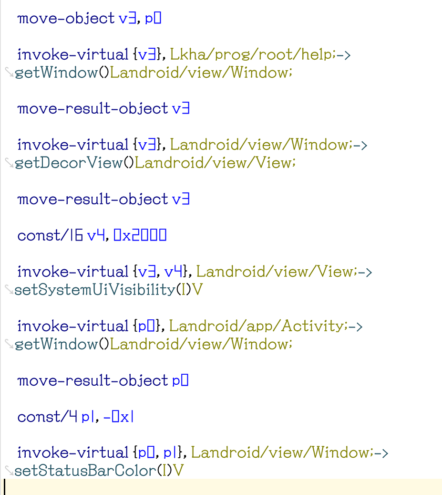
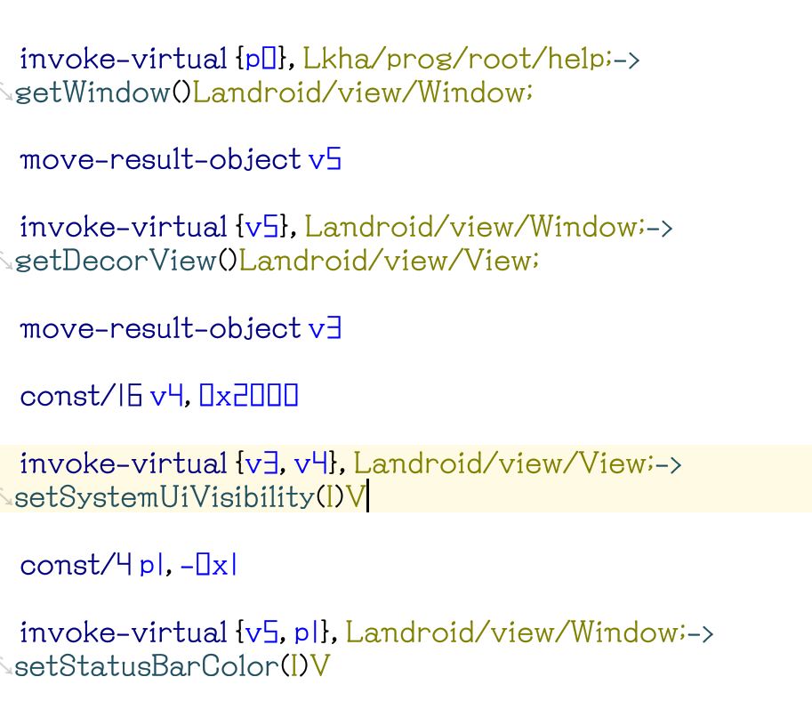

# [⇦][] 合并重复代码，提高代码效率  
写在前面：如果你不在乎半秒甚至小于半秒的性能提升，你大可以不看这篇文章，这篇文章写给希望冲刺极限速度的开发者  
很多开发者都经常为自己的app速度比竞品慢而苦恼，明明逻辑已经尽可能简化了，速度还是不够快，有时候记录启动速度就是死活慢那么几十毫秒，实际上通过合并重复代码，我们完全可以有效提高app速度  
我们以下面这一段代码为例（图片版见图1）  
  
>      move-object v3, p0  
>      invoke-virtual {v3}, Lkha/prog/root/help;->getWindow()Landroid/view/Window;  
>      move-result-object v3  
>      invoke-virtual {v3}, Landroid/view/Window;->getDecorView()Landroid/view/View;  
>      move-result-object v3  
>      const/16 v4, 0x2000 
>      invoke-virtual {v3, v4}, Landroid/view/View;->setSystemUiVisibility(I)V  
>      invoke-virtual {p0}, Landroid/app/Activity;->getWindow()Landroid/view/Window;  
>      move-result-object p0  
>      const/4 p1, -0x1  
>      invoke-virtual {p0, p1}, Landroid/view/Window;->setStatusBarColor(I)V  

这段代码的含义是设置白底黑字的亮色状态栏，我们来分析一下哪里可以优化  
1,第一行把p0移动到v3后，这个变量只在第二行使用了一次，就被覆盖了，那么我们可以删除第一行，把第二行的v3直接改成p0，减少了一次移动变量  
2,第二行和第八行的的意义其实一样，因为这个activity顶部直接.super Landroid/app/Activity，引用父类方法和直接对自身引用效果一致，也就是说第二行得到的p3和第八行得到的p0是一样的，那么我们很明显不需要重复两次一样的操作。所以我们先把第八行删除。由于第二行得到的v3很快又被覆写了，所以第三行移动结果到v3改成v5（因为v5尚未被使用），然后第四行本来调用v3的改成v5，第十一行本来调用的p0这里也要改成v5，最后把已经废弃的第九行也删除  
这样我们就得到了下面优化后的代码（图片版见图2）  
  
>      invoke-virtual {p0}, Lkha/prog/root/help;->getWindow()Landroid/view/Window;  
>      move-result-object v5  
>      invoke-virtual {v5}, Landroid/view/Window;->getDecorView()Landroid/view/View;  
>      move-result-object v3  
>      const/16 v4, 0x2000  
>      invoke-virtual {v3, v4}, Landroid/view/View;->setSystemUiVisibility(I)V  
>      const/4 p1, -0x1  
>      invoke-virtual {v5, p1}, Landroid/view/Window;->setStatusBarColor(I)V  

优化后的代码显著短了很多，执行效果却完全一样，因为少了一些不必要的重复步骤，这一段新代码会取得更高的速度（琴梨梨自己测试提升在40ms左右，对于本来130ms左右的启动时间提升已经挺大了）

[⇦]: ../../list.md
