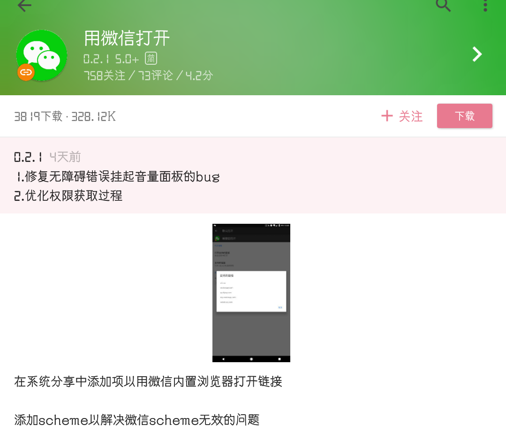
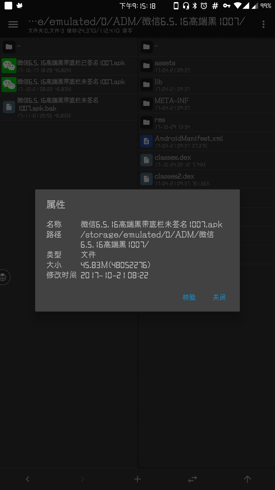
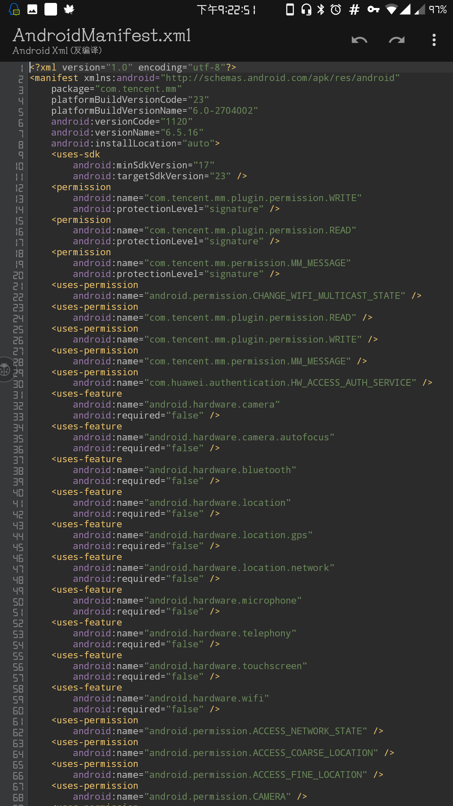
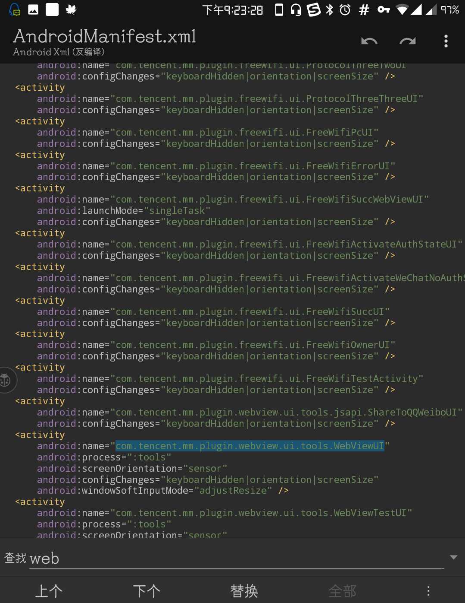
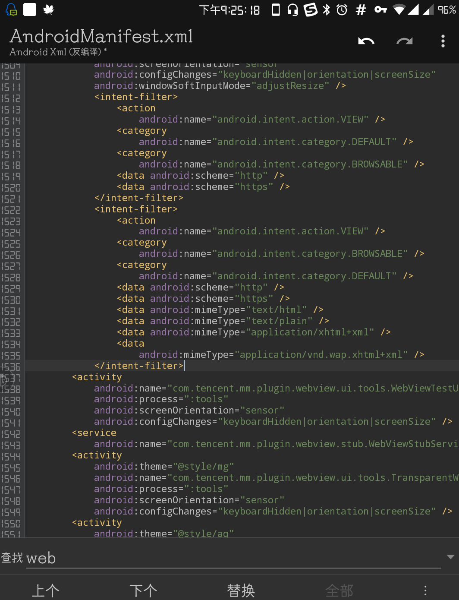
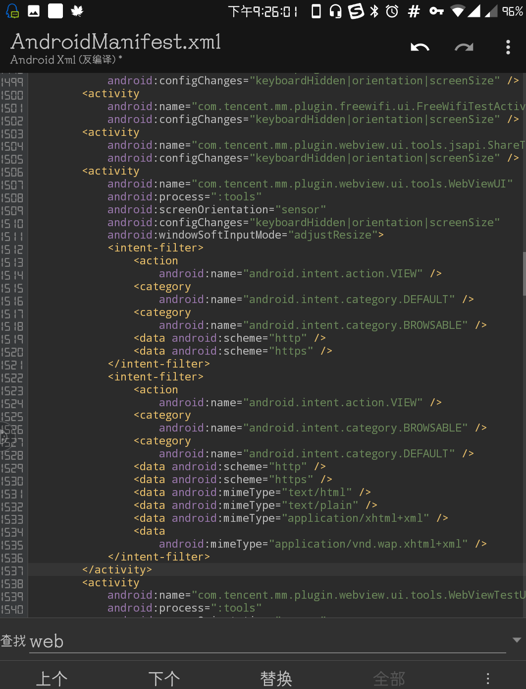
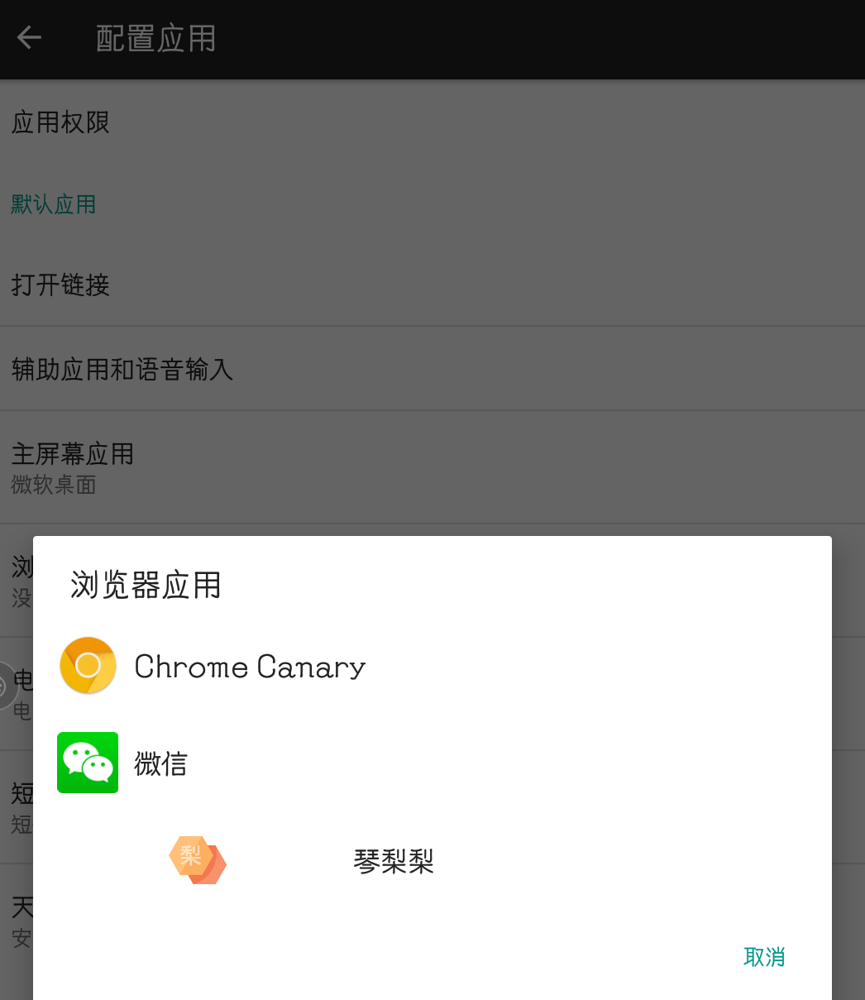
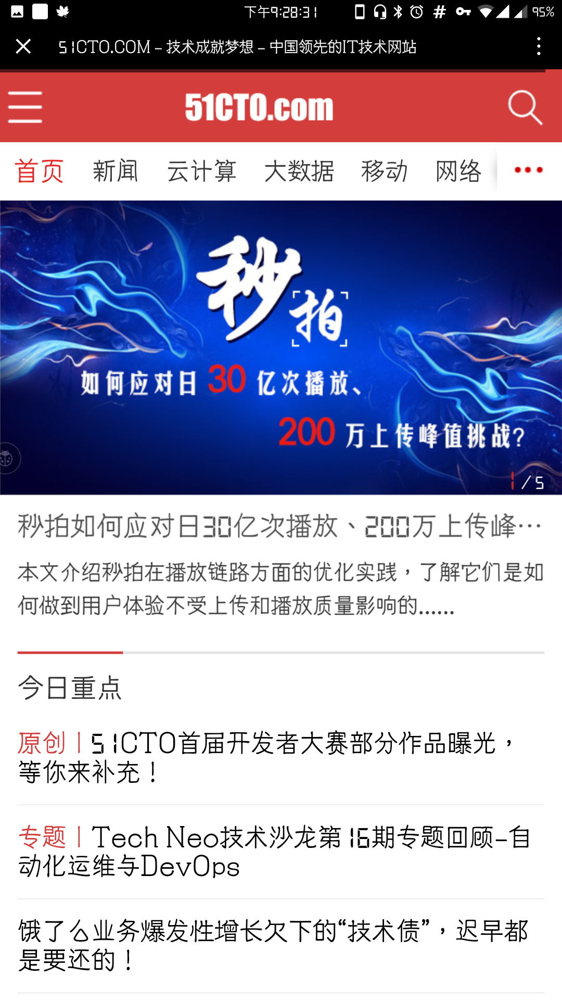
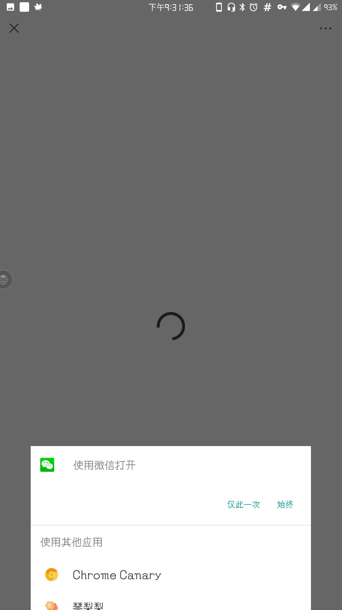

# [⇦][] 无需工具，让微信打开任意网页  
你们是不是遇到过“必须在微信内打开”的链接？是不是还要复制地址去微信找人发送再点开？是不是厌倦了这么繁琐的方式？  
很明显不少人都已经厌倦了，于是这么一款工具出来了  
  
可是还要再安装个APP多少有点不爽，于是琴梨梨又拆了微信包，在混淆的不成样子的安装包里总算找到了办法，于是就有了这篇教程。  
工具:MT管理器(你也可以在PC端使用apkdb操作)  
准备工作:把你的微信安装包提出来(微信安装包在/data/app/com.tencent.mm/base.apk)  
琴梨梨继续用上次添加过扫一扫的包改  
  
STEP1 复制下面的代码到剪贴板  
>             <intent-filter>  
>                 <action  
>                     android:name="android.intent.action.VIEW" />  
>                 <category  
>                     android:name="android.intent.category.DEFAULT" />  
>                 <category  
>                     android:name="android.intent.category.BROWSABLE" />  
>                 <data android:scheme="http" />  
>                 <data android:scheme="https" />  
>             </intent-filter>  
>             <intent-filter>  
>                 <action  
>                     android:name="android.intent.action.VIEW" />  
>                 <category  
>                     android:name="android.intent.category.BROWSABLE" />  
>                 <category  
>                     android:name="android.intent.category.DEFAULT" />  
>                 <data android:scheme="http" />  
>                 <data android:scheme="https" />  
>                 <data android:mimeType="text/html" />  
>                 <data android:mimeType="text/plain" />  
>                 <data android:mimeType="application/xhtml+xml" />  
>                 <data  
>                     android:mimeType="application/vnd.wap.xhtml+xml" />  
>             </intent-filter>  
顺带先科普下这段代码的用处是什么  
>                  <action  
>                      android:name="android.intent.action.VIEW" />  
>                  <category  
>                      android:name="android.intent.category.DEFAULT" />  
>                  <category  
>                      android:name="android.intent.category.BROWSABLE" />  
这一段时声明打开方式，意思是说下面的声明是一种打开方式  
>                  <data android:scheme="http" />  
>                  <data android:scheme="https" />  
scheme后面跟的是链接类型，即xxxx://123456中的xxxx，比如你要打开huaji://haipa，只要把http或者https改成huaji就行了  
>                  <data android:mimeType="text/html" />  
>                  <data android:mimeType="text/plain" />  
>                  <data android:mimeType="application/xhtml+xml" />  
>                  <data  
>                      android:mimeType="application/vnd.wap.xhtml+xml" />  
这一堆声明到时打开的文件格式，mimetype后面跟支持的格式，html/plain/xhtml＋xml是浏览器一般支持的格式，你也可以添加图片类格式等等  
STEP2 反编译你的微信包内manifest文件  
  
STEP3 查找下面这个活动  
com.tencent.mm.plugin.webview.ui.tools.WebViewUI  
这个活动就是微信内置浏览器的活动，注意不要找偏，找错了是不能改成功的  
  
STEP4 把STEP1的代码复制在这个活动的后面，紧跟着  
  
STEP5 删除活动原末尾的“/”，在新的末尾换行和下面的标签对齐输入</activity>  
效果应该如下图  
  
STEP6 保存回编译并安装，去设置里找默认浏览器，如果微信出现在列表里就说明成功了，现在通过外部浏览器打开可以支持微信内打开了  
  
现在我们来测试个外部链接，比如qq内在安装“去你大爷的内置浏览器”的情况下的链接  
点下链接，微信出现在选择列表里  
  
选择微信，看，页面在微信里打开了！  
  
贴吧此时使用外部浏览器打开也可以选择微信了  
  
是不是很方便？现在所有网页都可以通过微信打开啦！  
PS:微信签名后很多APP分享到微信不可用，虽然如此修改后可以通过用微信打开链接再分享的办法解决，但是我更建议核心破解后直装，这样可以保证完整的体验  
安卓的优势就在于开放，这也意味着你可以动手打造一个更智能的系统，系统的智能不是与生俱来的，只有你愿意花一点时间去折腾，你的手机才能真的变成“智能机”，而不是功能繁多的功能机

[⇦]: ../../list.md
