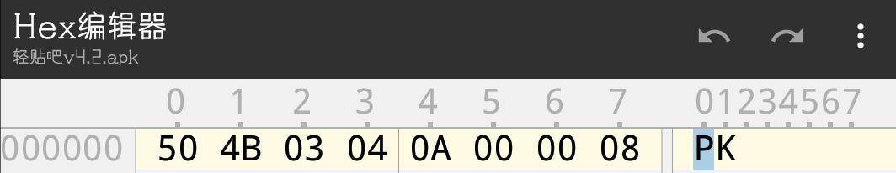
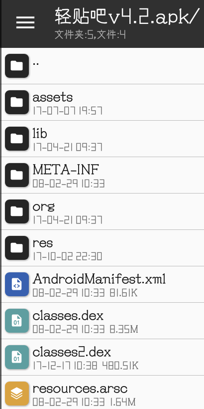
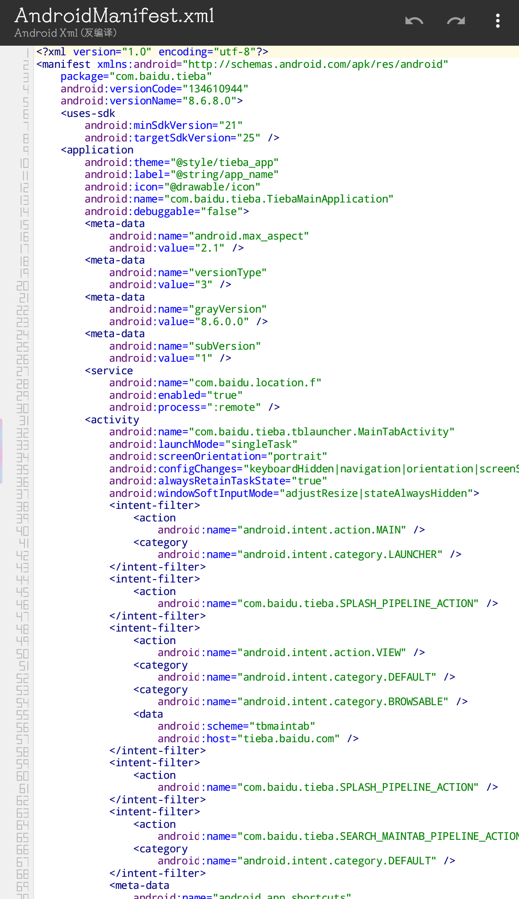
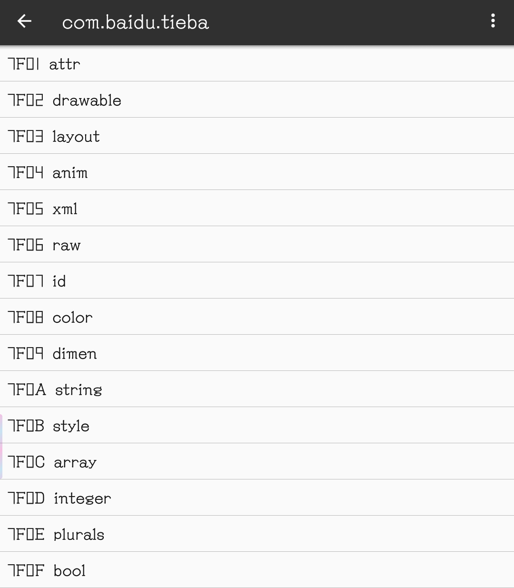
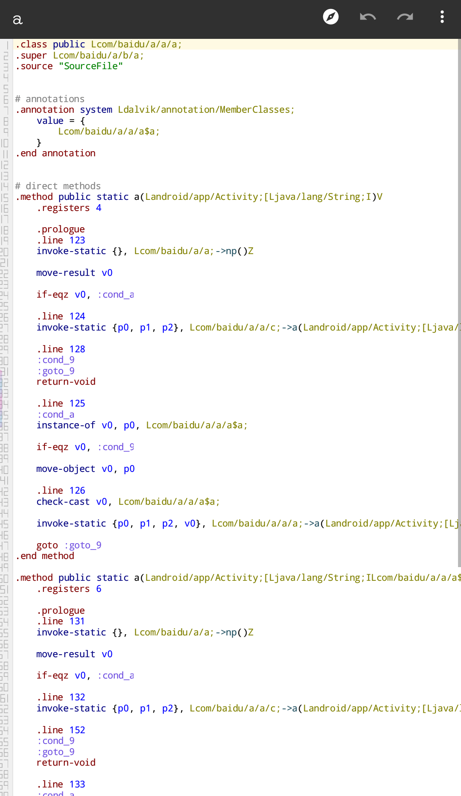
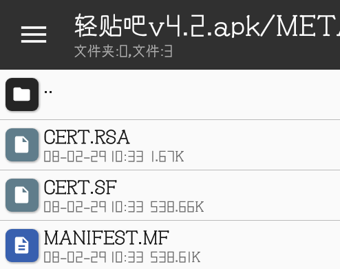
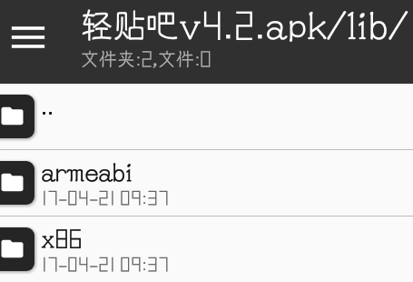
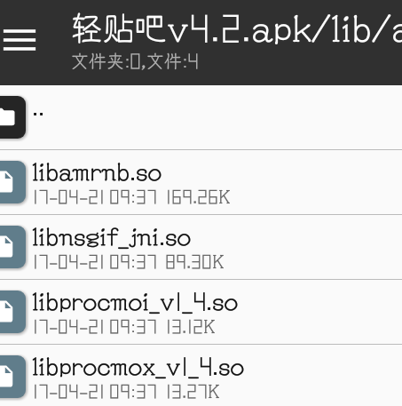
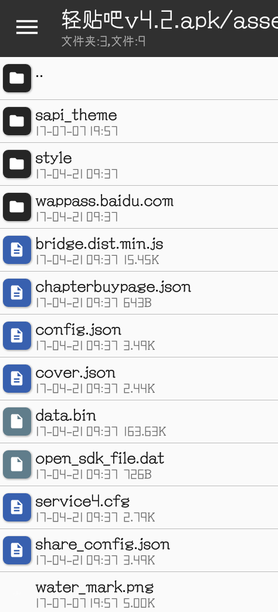
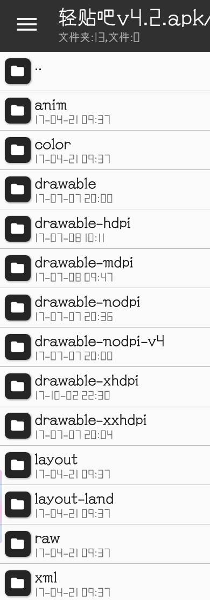

# APP魔改行动1-APK文件的主体结构  
琴梨梨终于放寒假啦！虽然作业超级多，但是琴梨梨还是计划每天给大家一篇教程。  
在魔改一个APP之前，首先要做的就是看看有什么可以改的，也就是说，改包还需先拆包，所以我们必须从拆包入手。  
APK文件本质是一个zip压缩包，我们可以看到头部标识为PK，和zip格式一样  
  
所以我们可以用任意支持打开zip的工具打开apk，打开后我们可以看到下面一堆文件夹和文件  
  
以琴梨梨修改的轻贴吧为准  
其中必须存在的是AndroidManifest.xml，这个文件记录了所有声明。这个文件并非以正常xml格式保存，必须通过反编译才能正常显示，否则打开是乱码。  
  
在绝部分APP内，都存在至少一个dex文件以及只有一个的arsc文件  
arsc文件记录了资源的对应值，经常看到的7f0x就来自这个文件  
  
dex文件是程序的代码部分，以smali语言保存，smali是一种高度接近机器语言的语言，在编译apk时所有java代码都会转为smali，这有助于改善性能，因为java直接执行的效率并不高。  
smali的上手难度并不高，但是要想彻底看懂，还要费一点功夫，高度接近机器语言也导致会把代码拖得很长，需要有足够的耐心分析。  
  
META-INF文件夹保存了签名信息，我们常说的核心破解，破解的就是对这个文件夹里文件的检验，一些APP会读取这里的文件检测是否和原版匹配来减少改包(但是完全阻止改包是不可能的)   
这个文件夹我们在改包的时大部分时候都可以完全不去动它，除非需要制作核心破解专用安装包  
  
lib文件夹存放了一些native库，这个文件夹并不是每个apk都有，如果apk不需要引用，它可以不存在，由于native类语言需要针对不同架构编译，这里的库并不能跨架构通用  
  
点开某一架构的文件夹，里面就是已经编译好的so文件  
  
支持的架构决定了APP可以安装在什么架构的设备上，也决定了APP的运行效率。比如仅支持arm64，在armv7和x86的设备上就不能使用，仅支持x86，那么在arm和mips设备上都不能用，x64设备上也只能以32位运行。  
不过native库不仅仅可以存在lib文件夹内，还可以存在于assets目录。  
assets目录是个可选存在的目录，用于存放一些额外的资源。这个目录啥都可以放，并且可以轻松调用，这里面的内容往往很复杂，怎么判断里面的文件类型和作用会在接下来的教程里提到。  
   
res目录一般情况是必须的，它保存了APP的绝大部分资源文件(当然也可以修改arsc重定向，然后资源文件全都丢到其他位置)，但是这个目录也可以以其他形式存在，比如在混淆包里，它就是r目录。  
这个目录里面往往存在大量子目录，一般分下面几个。  
anim:动画xml，声明动画  
color:色彩xml，定义色彩  
drawable:元素样式，可以是xml也可以是图片  
layout:界面布局文件，只能是xml  
xml:一些其他xml文件  
menu:菜单xml，定义菜单项  
raw:其他类型的资源，啥都可以放，区别于丢在assets目录，丢在这里的资源在arsc文件里也有一条记录  
文件夹后面可加后缀，比如-v21之类的，声明指定在某种设备/环境下使用。比如常见的  
-mdpi，-hdpi，-xxhdpi:不同dpi设备使用，往往为了在碎片化的安卓设备上都能正常显示  
-v16，-v17，-v25:不同Android SDK版本使用，也就是不同系统版本使用，用于兼容新特性同时兼容老系统  
-land，-port:landscape和portrait的缩写，横竖屏的区别  
  
了解了这些文件布局，对我们今后的魔改很有帮助  
