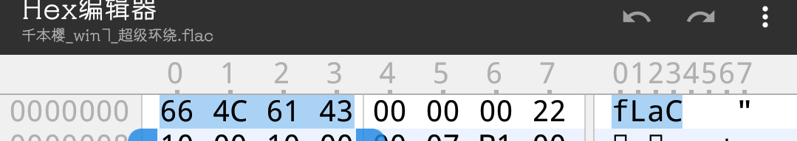
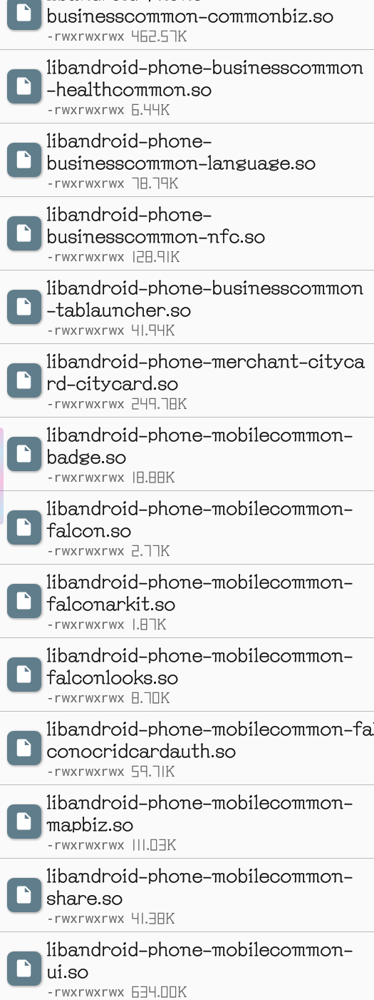
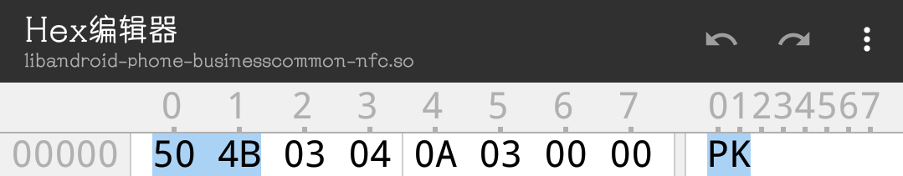
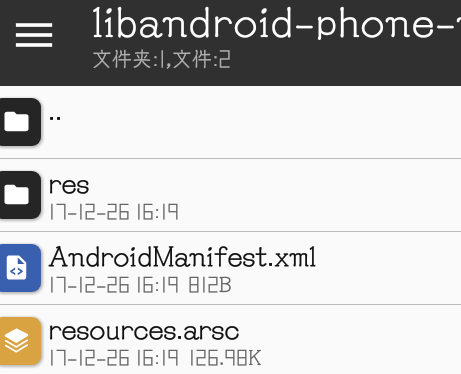
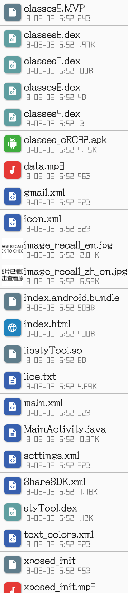
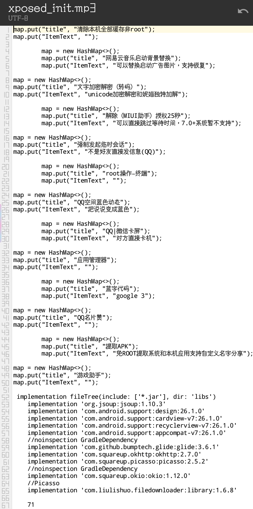

# [⇦][] APP魔改行动2-不同资源文件都告诉了你什么  
上篇讲过了apk内的文件结构，这篇来讲讲我们可以分析里面的文件得出什么。  
首先我们要了解一下什么是文件头。  
文件头是用于标识文件格式的，在文件最前面的一些字符。系统在识别格式的时候很明显不可能读取整个文件，不然的话一个40g的压缩包打开一下要几分钟，所以系统就读取文件头，判断格式。  
文件头区别于后缀名，后缀名是为了方便判断格式的，但是不一定就是文件的真实格式，并且在一些系统上没有后缀名这个概念。  
比如这个flac文件，它的文件头就是fLaC，16进制下是66 4c 61 43，系统读取到这个文件头，就判定为flac格式，从而使用flac的解码方式打开  
  
我们可以把这个文件的后缀改成ogg，却照样可以播放，也证明了后缀并不作为文件打开时判断格式的标准。  
  
在了解了文件头之后，显而易见，我们不能唯后缀论了，判断一个文件的真实格式，必须看文件头。  
比如我们来看一下这些.so文件，提取自支付宝  
  
他们的文件头竟然是PK！而PK是zip的文件头  
  
我们以zip格式打开试试，果真可以正常打开，这确实是一个zip文件，准确说从里面的内容来看是一个apk文件  
  
可能有人要问为什么要学文件头判断，其实原因很简单，并不是每个开发者都会给你展示真实的后缀名，在修改时我们也需要尝试对一些后缀名不正常的文件分析并修改，所以了解文件头很重要。在这里不得不提一下后缀混淆大佬妮哩。  
满满一排assets里面没几个是真实后缀的  
  
比如这个mp3后缀的文件，竟然只是普通文本  
  
讲完文件头，接下来就要讲讲一般的apk里有哪几类文件  
1图片类，一般在res目录内，png，jpg最为常见，也有webp  
2文本类，包括xml和普通文本  
3核心组件类，dex，so这些都是  
4其他媒体类，音频甚至视频都可能存在，但是不是每个包都有  
5杂七杂八类，其他格式特殊的文件，或者无法判断格式的文件，这些文件一般我们也拿它们没办法  
在下一篇文章里，琴梨梨会讲讲怎么看懂manifest  

[⇦]: ../../list.md