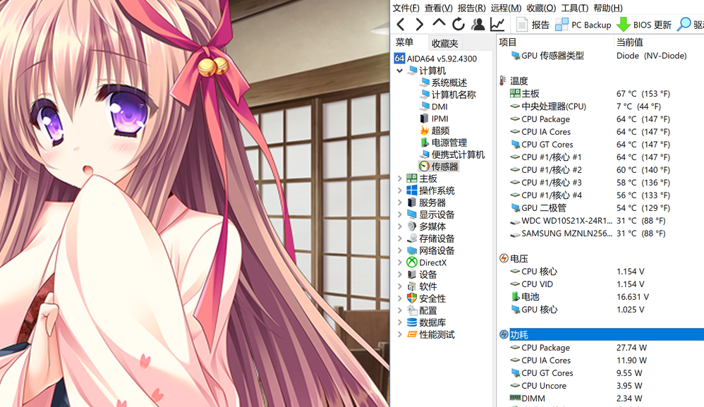
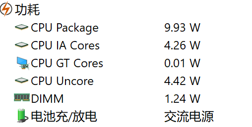
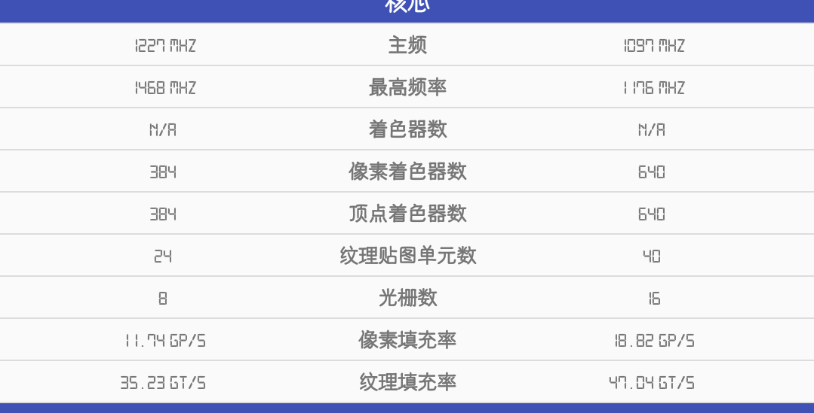
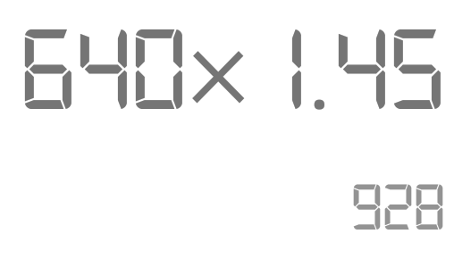
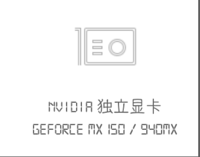
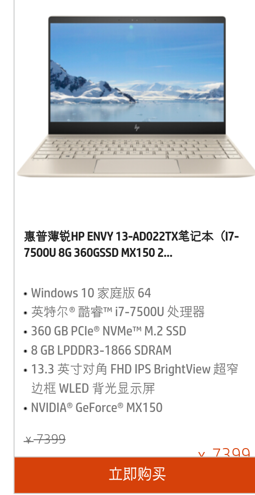
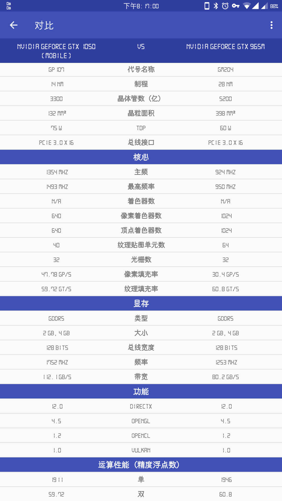

# [⇦][] 为什么我推荐娱乐本和轻薄本上1050  
本篇文章会从以下几个部分来讲述为什么我推荐娱乐本和轻薄本上1050  

1. 为什么我不推荐核显  
2. 为什么我不推荐mx150  
3. 1050到底有多强  

说在前面:虽然这篇文章存在主观性观点，但是即使你不赞同该观点，干货部分也是可以看的，相信看完后你会对三者优劣有更深的了解  
那么开始吧  
## 零，一些必要的科普  
mx150分为两个版本，tdp分别为8w和25w。8w版本，个人习惯叫它mx150maxq。两者区别只在频率。  
流水线，即流处理器，个人习惯叫流水线。  
## 一，为什么我不推荐核显    
简要来讲其实就是因为核显能耗比实在不好看。在我的y700(6700hq＋960m)使用核显推游魂2这样没有3d也没有复杂图形的gal时，通过aida64查看功耗，CPU GT CORE功率已经达到了惊人的10w，而940mx的功耗都没这么高，却拥有比6700hq带的核显更强的性能。  
  
游魂2时的核显功耗  
而搭载最强核显iris系列的cpu，核显部分功耗甚至达到了20w，性能却和25w版本的mx150差不多甚至不如，这样的核显，怎么能让人欢迎它？  
但是核显是也有必要存在的，在桌面下核显的功耗仅仅0.04w，比独显优秀太多，而且为了实现独显热插拔，现在笔记本大多采用纯核显输出方案，即使使用独显渲染，画面最终也由核显输出。这就意味着即使全局独显渲染，核显那至少0.04w也必须存在。因此在无需独显出动的桌面这样的场景，很明显核显更有优势，毕竟少一样硬件通电必然省电。  
  
核显桌面待机功耗  
## 二，为什么我不推荐mx150  
其实并不是说mx150见到就可以滚了，对于有一定经验的老手，mx150倒是可以作为选择之一。但是对于小白，请不要选择mx150。原因也很简单，老黄对于两个版本采用了相同的mx150这个命名，而且除了测试频率和功耗，根本看不出两者区别，而实际上只有25w版本值得选择。  
  
这是一颗标准的25w的mx150  
mx150的性能实际上说追960m的确不是开玩笑。虽然mx150只有区区384条流水线，960m却有640条，但是mx150在频率上远超960m  
  
左侧mx150，右侧960m  
通过对比图，我们可以看到mx150的频率比960m高了接近300mhz，而实际体验中mx150更是可以boost到1.7g左右甚至更高，960m即使超频也只能稳定boost在1.45g。显卡换架构在同频效率上的提升一般也就10%左右最多，算上制程换代也可以带来10%左右提升，这么来看  
  
960m  
  
mx150  
mx150的确有追960m的资本。当然也只能是追罢了，超越还不可能。  
  
默频单双精度对比  
960m的确已经是可以算上游戏本水准，满血的mx150也能进入游戏本水准，但是...  
目前发布的搭载mx150的笔记本中，绝大部分都是限制的8wtdp！！！包括小米笔记本和envy13也一样！！！  
在限制tdp后，mx150的频率被严格锁死，boost也很难突破1.45g，大部分时间甚至都是ghz出头跑，mx150的频率优势丧失的一干二净，即使制程和架构有点优势也拉不回来差距了。  
而之所以不推荐小白的原因就是，厂商不会告诉你他的mx150有没有锁8w  
  
小米笔记本宣传图  
  
envy13宣传图  
看到这里，各位应该已经明白了我不推荐的是mx150maxq，而不是标准版mx150，对于标准版的mx150，是绝对值得选择的。 
## 三，1050到底有多强  
先上一张对比图，为了更好的反映1050的性能，这里选择的对比卡是使用GM204大核心版本的965m(另外有一个GM206核心的965m)  
  
可以看出，1050和965m的性能几乎所差无，还拥有更高的显存带宽，同时核心面积更小。而965m几乎已经是中档甚至中高档游戏本的标配。  
由此来看，1050的性能确实够强，有资格担当中端独显。  
当然1050也有不可否认的缺点，那就是功耗。众所周知，频率和功耗是几何增长关系，即频率翻倍情况下功耗远不止翻倍，可能甚至要翻四倍。1050就是因为高频导致虽然流水线更少，晶体管数更小，核心面积也更小，甚至制程领先一截的情况下tdp仍然高达75w，甚至超过了965m的60w。  
不过别担心，1050并不会降低你太多的续航。日常使用时1050的功耗受益于制程，只会低于965m，而重负载受到散热能力限制(小面积也一定程度降低了散热能力)，实际也只能鸡血一段时间，长时间下来实际tdp并没有那么高。  
现在你是不是对于核显、MX150和1050有了更多的了解呢？个人观点是对于小白请无脑选1050意思显卡，对于有一定经验的人可以选择标准MX150.当然你也可以持自己的意见，琴梨梨写这篇文章，一方面表达自己的观点，另一方面也希望让各位对笔记本显卡选择了解更多一点。  

[⇦]: ../../list.md