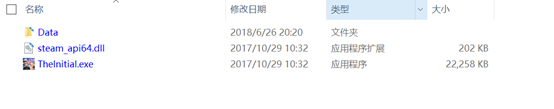
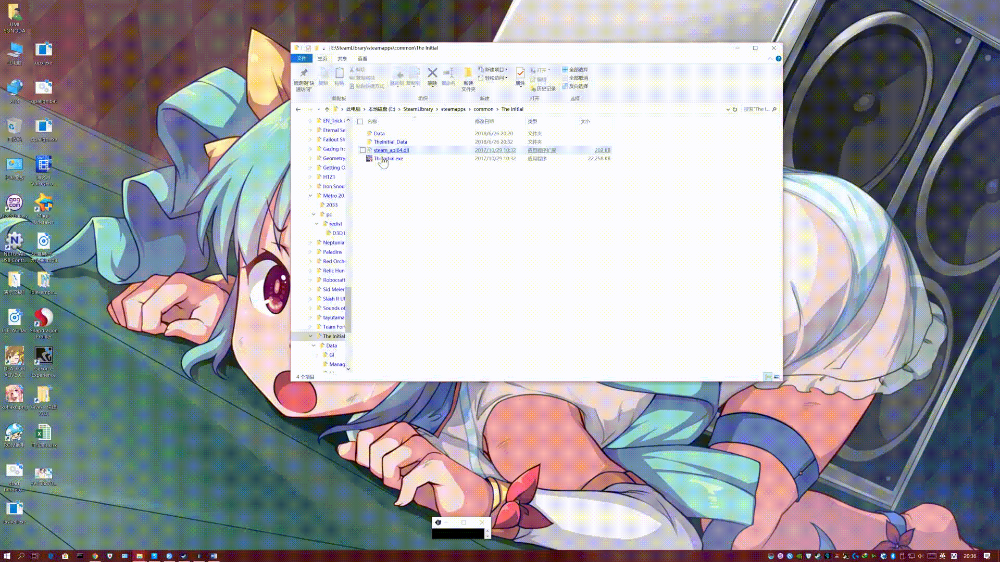
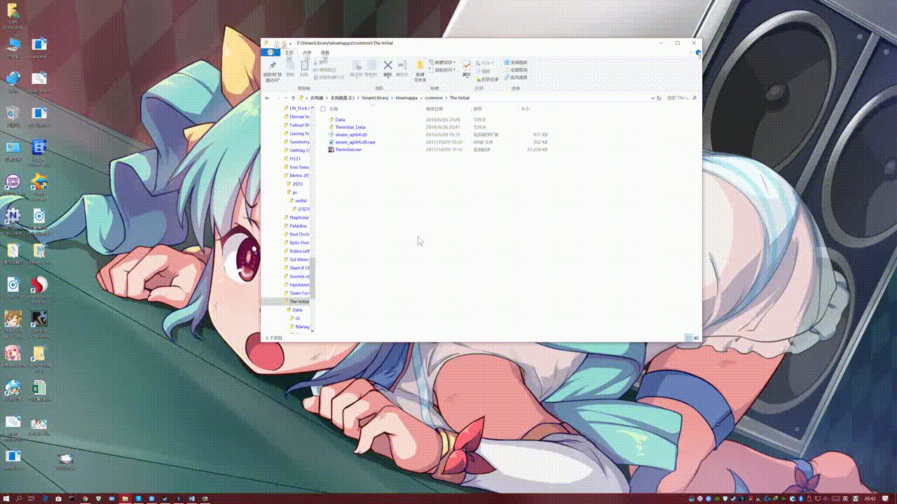
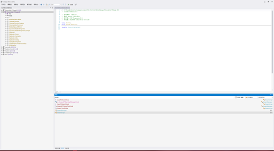
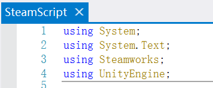
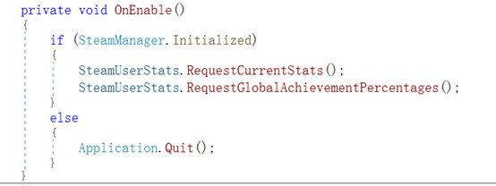
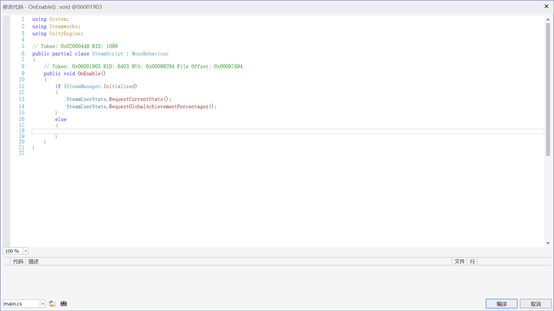
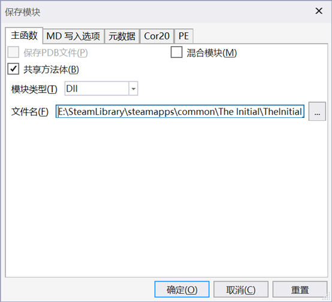
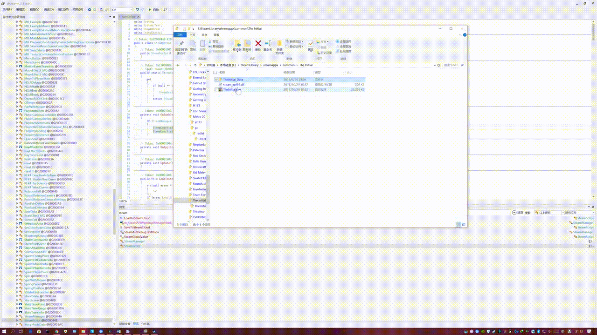

# [⇦][] 一次移除游戏Steam版权保护的实录  
众所周知Steam上大部分游戏都启用了steamapi，而且有相当一部分为了避免下载后直接拷贝出去分发，都会在启动时校验SteamApi来验证是否为正版。  
但是，作为DRM-free支持者，琴梨梨当然不愿意为了把游戏装进移动硬盘还要再复制一个steam客户端进去，所以就有了这次移除SteamApi版权保护的经历。  
这次选择的游戏就是一个使用SteamApi防盗版的典型。我们直接打开游戏根目录。  
  
可以看出这很明显是一个使用Unity引擎的游戏。  
先不用Steam启动看看  
  
是的，刚刚过完Logo，这游戏就自己退出了。  
于是找来某三大妈通用的Steam Api破解版dll，替换  
  
这下能正常载入了，说明判断只是判断有没有返回值而不是向steam获取账户详细信息，好办  
因为是Unity引擎的游戏，所以果断开DnSpy  
打开Csharp文件，搜索steam  
  
看到最下面那个SteamScripts基本可以确定就是这个了，点开  
  
看到using Steamworks，验证之前的想法，确实就是这里  
一点点往下翻，然后注意到了这个void  
  
关键点在于这个Application.Quit，加上这个if判断，基本可以确认这个void的含义就是请求SteamApi，如果存在，获取用户的状态和成就，如果不存在，就退出。  
右键编辑方法，把含有Application.Quit的这一行删除  
  
直接回编译  
  
现在再运行一次，完美，成功不调用Steam启动！  
  
后记：这种办法只适用于拷走玩的情况，不能记录成就和时长  

[⇦]: ../../list.md
