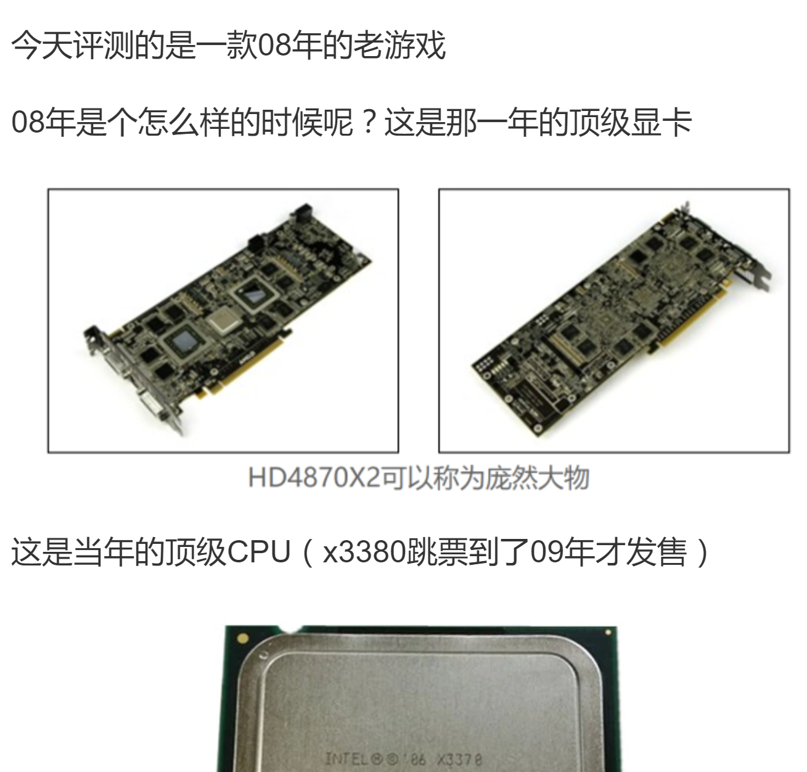
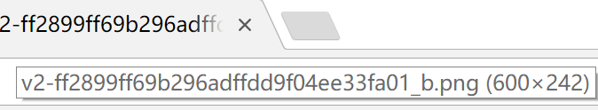
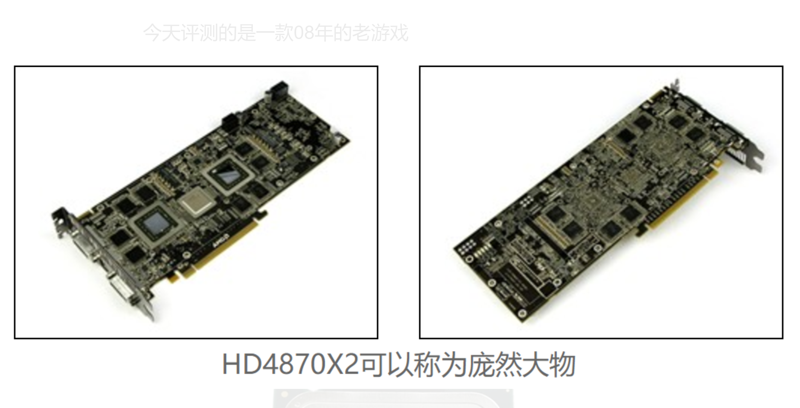
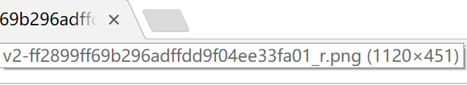
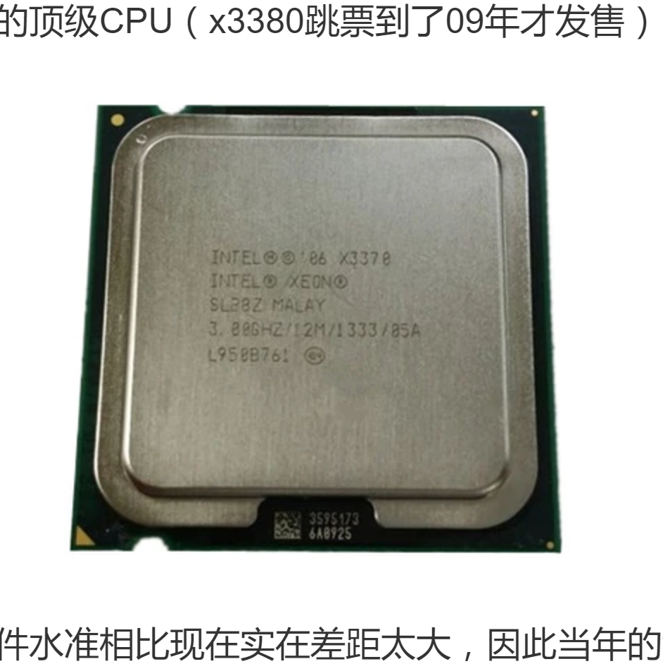
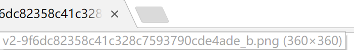
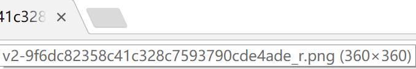
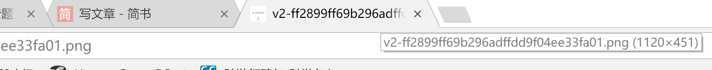

# [⇦][] 抓取知乎内图片的高清晰度版本  
这几天忙着转移知乎上的文章过来，在转移部分图片时偶然间分析出了知乎图片不同清晰度版本的获取方式
以下面这一段为例子  
  
直接右键复制第一张图的链接https://pic2.zhimg.com/v2-ff2899ff69b296adffdd9f04ee33fa01_b.png，分辨率为600x242  
  
现在点击这张图片放大  
  
再次右键复制地址https://pic2.zhimg.com/v2-ff2899ff69b296adffdd9f04ee33fa01_r.png，分辨率为1120x451  
  
比较两个链接，发现区别在后缀上，小的那张是_b，大的是_r  
那么接下来我们找一张不能放大的小图看看是否也有此规律  
这张cpu的图片点击无法放大  
  
复制地址https://pic3.zhimg.com/v2-9f6dc82358c41c328c7593790cde4ade_b.png，图片分辨率为360x360，地址很明显带_b  
  
改后缀为r，打开，还是360x360，说明这张图两个版本相同  
  
那么有没有更简单的办法呢？  
答案是有，删掉后缀就行，这样无论图片有几种清晰度都能拿到尽可能高清晰度的版本，简单粗暴  
  
扩展信息：其实淘宝的图片也是通过后缀控制清晰度的，有兴趣的小伙伴们可以去分析一下，琴梨梨会在有空的时候针对淘宝图片的地址后缀也写一篇文章加以分析  

[⇦]: ../../list.md